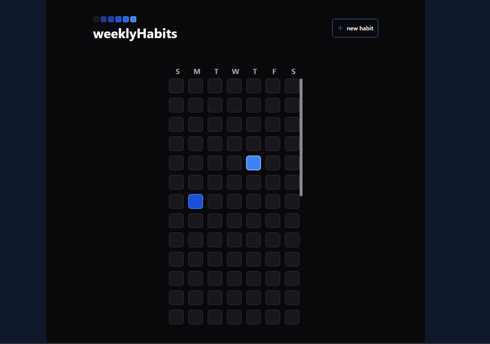
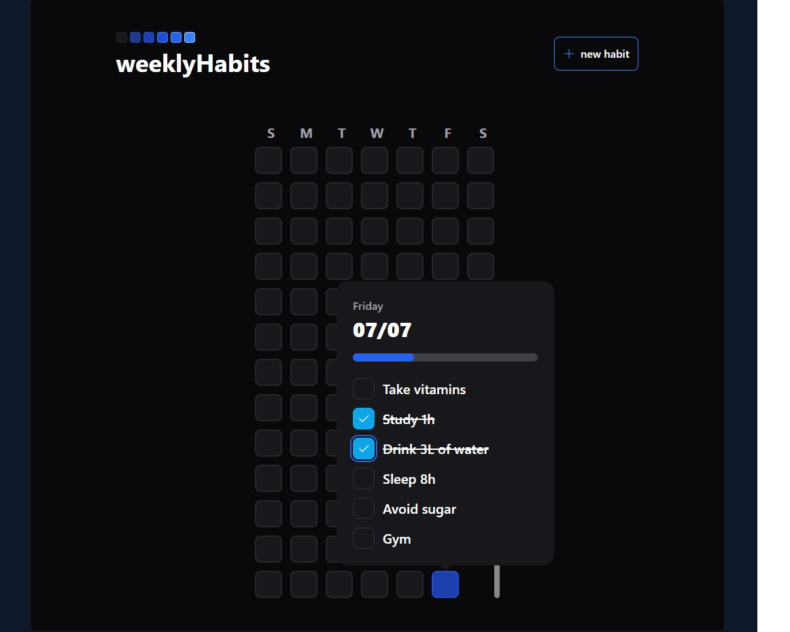
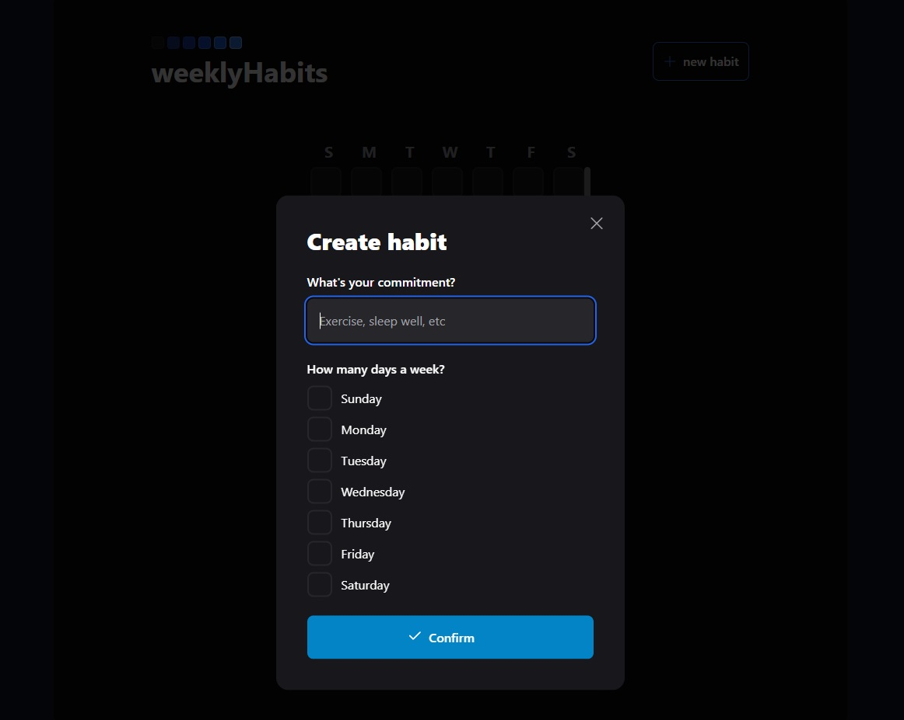
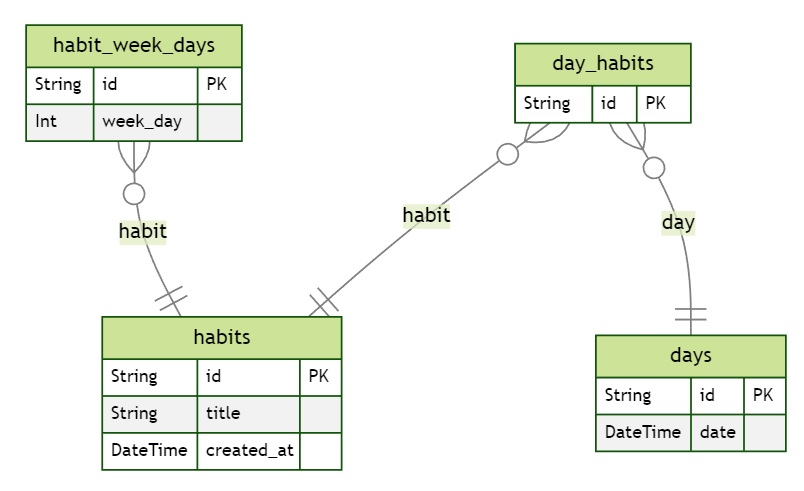

## Technologies ReactJS frontend web 🌐

- ReactJS
- Vite
- radixUI checkbox
- radixUI dialog
- radixUI popover
- clsx
- dayjs
- phorsphor-react
- sass
- tailwind
- typescript

## Technologies NodeJS fastify 🔌

- prisma
- prisma-erd-generator
- tsx
- typescript
- fastify
- zod
- dayjs

## ❓ How to install

### Prerequisites

Before you begin, you will need to have the following tools installed on your machine: [Git](https://git-scm.com), [Node.js](https://nodejs.org/en/) and a package manager [Yarn](https://yarnpkg.com/) or [npm](https://www.npmjs.com/).

In addition, it is necessary to have the backend running.

### ⏯️ Run application

Follow the steps below to run the app:

1. Backend

```bash
# Clone this repository
$ git clone https://github.com/HenriqueMaffi/dailyhabits.git

# Access the directory
$ cd dailyhabits/server

# Install all dependencies
$ yarn
# or
$ npm install

# run migrations
$ yarn prisma migrate dev

# if you want to see the data and tables more info in https://www.prisma.io/docs
$ yarn prisma studio

# Run the application in dev mode
$ yarn dev
# or
$ npm run dev

```

2. Frontend web

```bash
# Clone this repository
$ git clone https://github.com/HenriqueMaffi/dailyhabits.git

# Access the directory
$ cd dailyhabits/web

# Install all dependencies
$ yarn
# or
$ npm install

# Check if your machine's ip number matches in the src/lib/api.ts file

# Run the application in dev mode
$ yarn dev
# or
$ npm run dev


# Open the browser in http://localhost:5173/

```

## :memo: License

This project is under the MIT license.

---

Made with ♥ by Henrique Maffi [Get in touch!](https://www.linkedin.com/in/henriquemaffi/)
